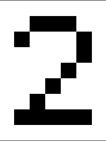
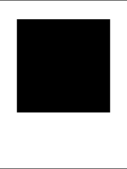

# MAP401 - Compte-rendu Tâche 2 Partie 1

## Images de test




```
Contour avec 41 points
[ (  2.0,  1.0) (  3.0,  1.0) (  4.0,  1.0) (  5.0,  1.0) (  5.0,  2.0) (  6.0,  2.0) (  6.0,  3.0) (  6.0,  4.0) (  5.0,  4.0) (  5.0,  5.0) (  4.0,  5.0) (  4.0,  6.0) (  3.0,  6.0) (  3.0,  7.0) (  4.0,  7.0) (  5.0,  7.0) (  6.0,  7.0) (  6.0,  8.0) (  5.0,  8.0) (  4.0,  8.0) (  3.0,  8.0) (  2.0,  8.0) (  1.0,  8.0) (  1.0,  7.0) (  2.0,  7.0) (  2.0,  6.0) (  3.0,  6.0) (  3.0,  5.0) (  4.0,  5.0) (  4.0,  4.0) (  5.0,  4.0) (  5.0,  3.0) (  5.0,  2.0) (  4.0,  2.0) (  3.0,  2.0) (  2.0,  2.0) (  2.0,  3.0) (  1.0,  3.0) (  1.0,  2.0) (  2.0,  2.0) (  2.0,  1.0)]
```

\clearpage




```
Contour avec 21 points
[ (  1.0,  1.0) (  2.0,  1.0) (  3.0,  1.0) (  4.0,  1.0) (  5.0,  1.0) (  6.0,  1.0) (  6.0,  2.0) (  6.0,  3.0) (  6.0,  4.0) (  6.0,  5.0) (  6.0,  6.0) (  5.0,  6.0) (  4.0,  6.0) (  3.0,  6.0) (  2.0,  6.0) (  1.0,  6.0) (  1.0,  5.0) (  1.0,  4.0) (  1.0,  3.0) (  1.0,  2.0) (  1.0,  1.0)]
```

\clearpage


```
Contour avec 5 points
[ (  3.0,  5.0) (  4.0,  5.0) (  4.0,  6.0) (  3.0,  6.0) (  3.0,  5.0)]
```
\clearpage